# MeuralPaint
Paint images using famous artistic styles in seconds (or less!) 

`quickpaint` using pre-trained styles (models) or `trainstyle` a new model on a new style

a TensorFlow implementation for feed forward CNN fast neural style transfer, based on  [1-3].  

works with different versions of pre-trained TF models, many pre-trained models included (more to come)

## Examples 

### input 

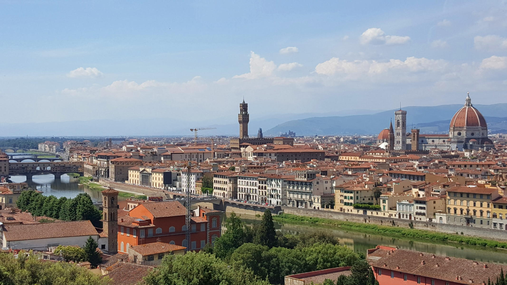 

| styles | outputs | outputs | styles  |
|:-----:|:-------:|:-----:|:-------:|
|  rain princess  | 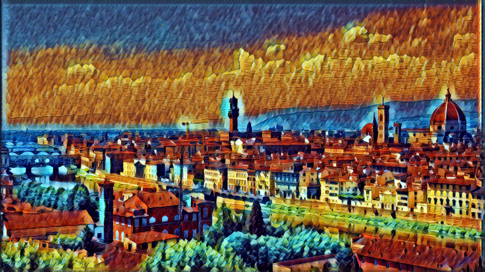 | 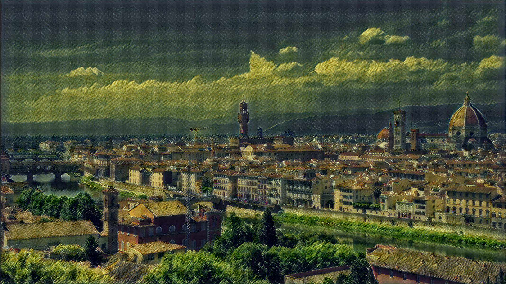 | the shipwreck of the minotaur  |
|  wave  | 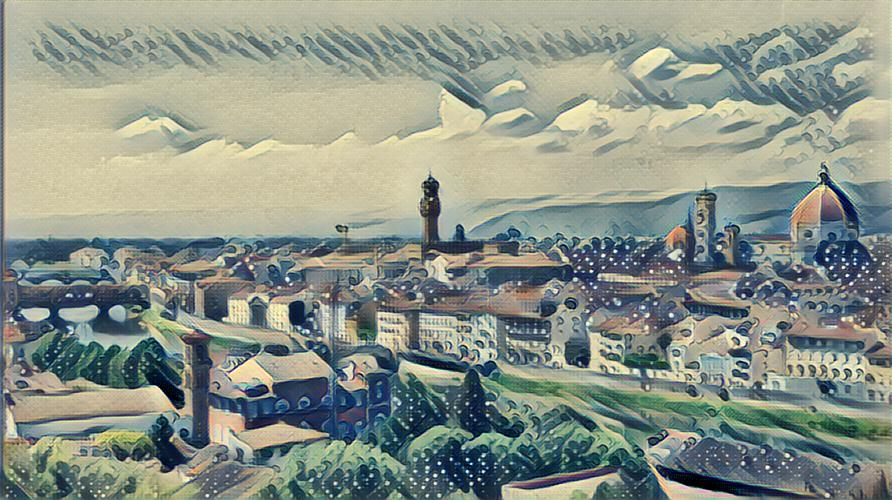 | 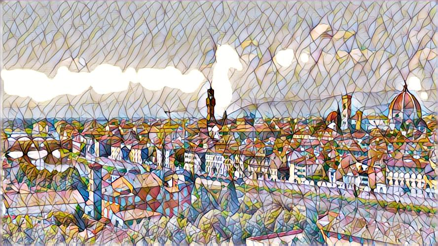 | mosaic  |
|  the scream  | 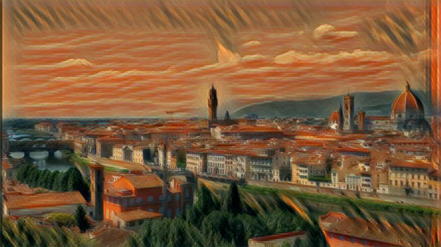 | 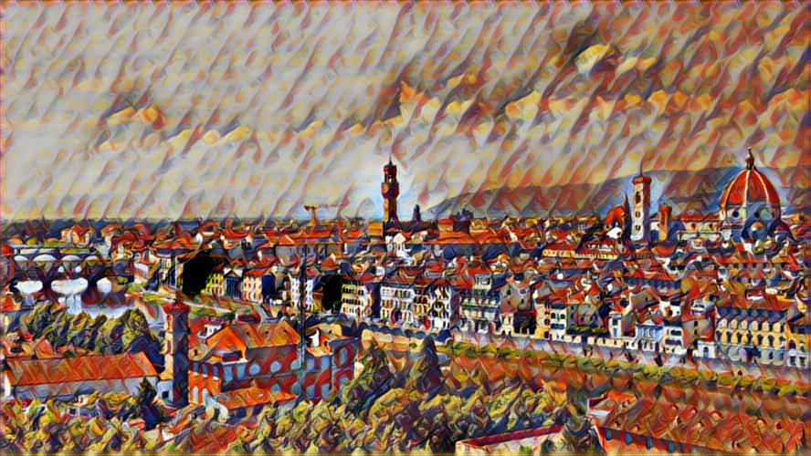 | composition vii  |
|  la muse  | 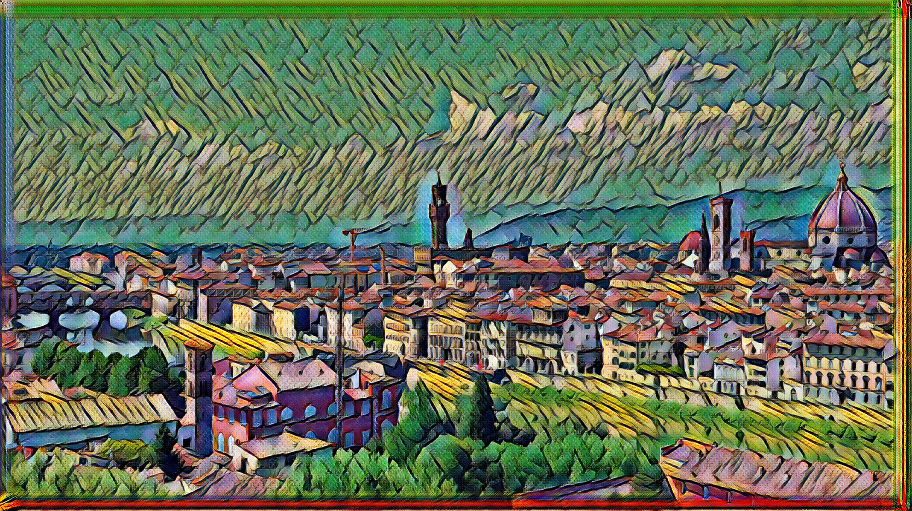 | 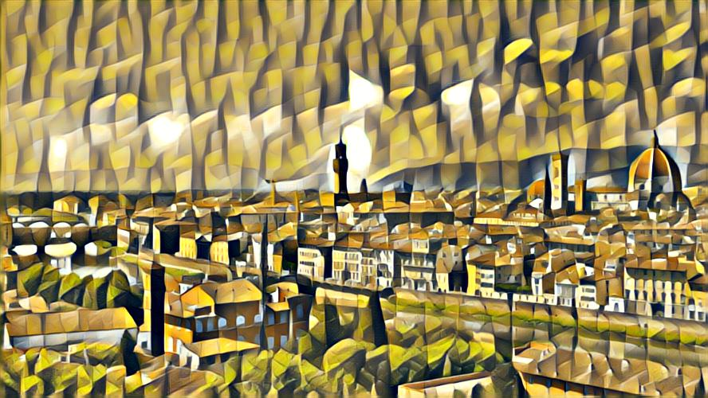 | cubist  |
|  udnie  |  | 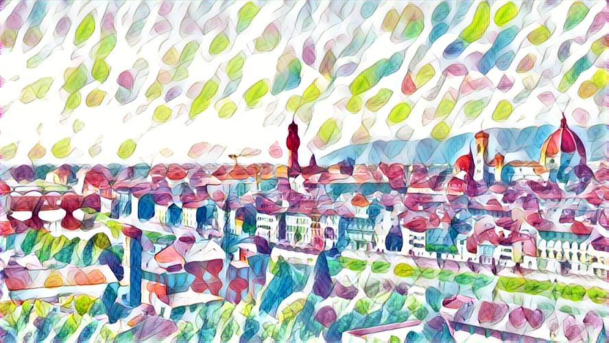 | feathers  |

## Usage

### QuickPaint

**GUI**:

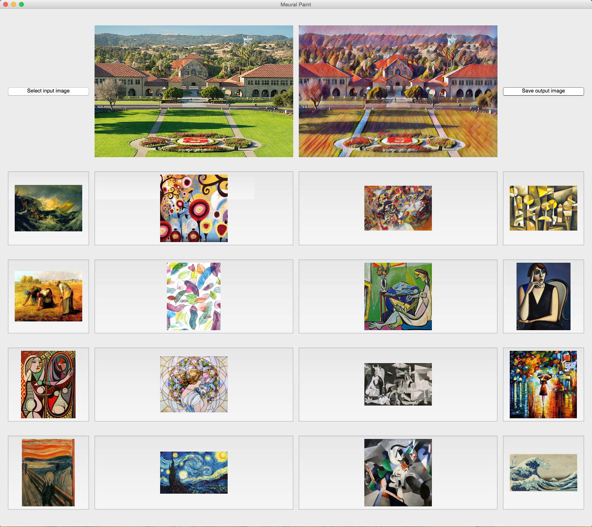 

**Command line**:

python `quickpaint.py` -i [ input (content) ] -o [ output (stylized content) ] -m [ model (style) ] -ma [ mask  ] -bl [ blend]

Example: python `quickpaint.py` -i inputs/stanford.jpg -o outputs/stanford_cubist.jpg -m pre-trained_models/cubist.model -ma 1 -bl 0.05

required arguments:  
`-i, --input`       dir or file to transform (content)  
`-o, --output`      destination (dir or file) of transformed input (stylized content)  
`-m, --model`       path to load model (.ckpt or .model/.meta) from

optional arguments:  
`-h, --help`          show this help message and exit   
`-d , --device`        device to perform compute on (default: /gpu:0)   
`-b , --batch-size`     batch size for feed-forwarding (default: 4)   
`-a , --model-arch`    model architecture if models in form (.model) are used, (default: pre-trained_models/model.meta)
`-ma, --mask`       create binary mask from input (@ 1% of max) and mask output  (default: 0 -> no masking)     
`-bl, --blend`      multiply the original image with the output using a weighting (factor) -- to preserve original colors / contrast (default: 0 -> no blending)

### TrainStyle

**Command line**:

python `trainstyle.py` -s [ style ] -c [ checkpoint dir ]  -o [ output test image ] -i [ checkpoint iterations ] -t [ training set path ]
-od [ output test dir ]  -cw [ content weight ] -tv [ tv weight ] -sw [ style weight ] - b [ batch size ] -l [ learning rate ] -n [ network path ]

Example: python `trainstyle.py` -s styles/the_scream.jpg -c checkpoint -o stanford.jpg 
-od test -cw 1.5e1 -i 1000 -b 20

required arguments:     
`-c, --checkpoint-dir`     dir to save checkpoint in      
`-s --style`               desired style image path  

optional arguments:     
`-h, --help`            show this help message and exit     
`-t , --train-path`     path to training images folder      
`-o , --output `        output test image at every checkpoint path      
`-od, --output-dir`     output test images dir      
`-e , --epochs `        # of epochs     
`-b, --batch-size`      batch size      
`-i , --checkpoint-iterations` checkpoint frequency     
`-n , --net-path`       path to VGG19 network (default data/imagenet-vgg-verydeep-19.mat)
`-cw, --content-weight` content weight (default 7.5)        
`-sw, --style-weight`   style weight (default 100.0)        
`-tw, --tv-weight`      total variation regularization weight (default 200.0)       
`-l , --learning-rate`  learning rate (default 0.001)       

## Dependencies

- Python 2.7.9
- TensorFlow 0.11.0 >=
- scipy 0.18.1  
- numpy 1.11.2

#### To train:

 1) COCO dataset (training data)
 http://msvocds.blob.core.windows.net/coco2014/train2014.zip
 
 2) VGG19 imagenet weights 
 http://www.vlfeat.org/matconvnet/models/beta16/imagenet-vgg-verydeep-19.mat

## Acknowledgements 

- Implementation based on fast-style-transfer: https://github.com/lengstrom/fast-style-transfer
by lengstrom (engstrom at mit dot edu)

- TF vgg network from: https://github.com/anishathalye/neural-style by anishathalye (http://www.anishathalye.com)

- Pre-trained models acquired from: 
    1) https://drive.google.com/drive/folders/0B9jhaT37ydSyRk9UX0wwX3BpMzQ
    2) https://github.com/junrushao1994/fast-neural-style.tf/tree/master/models   

## References

[1] Johnson, Justin, Alexandre Alahi, and Li Fei-Fei. "Perceptual losses for real-time style transfer and super-resolution." arXiv preprint arXiv:1603.08155.
https://arxiv.org/abs/1603.08155

check out Justin's repo for a theano/Lua implementation: https://github.com/jcjohnson/fast-neural-style

[2] Ulyanov, Dmitry, Andrea Vedaldi, and Victor Lempitsky. "Instance Normalization: The Missing Ingredient for Fast Stylization." arXiv preprint arXiv:1607.08022.
https://arxiv.org/abs/1607.08022

[3] Gatys, Leon A., Alexander S. Ecker, and Matthias Bethge. "A neural algorithm of artistic style." arXiv preprint arXiv:1508.06576.
https://arxiv.org/abs/1508.06576 
